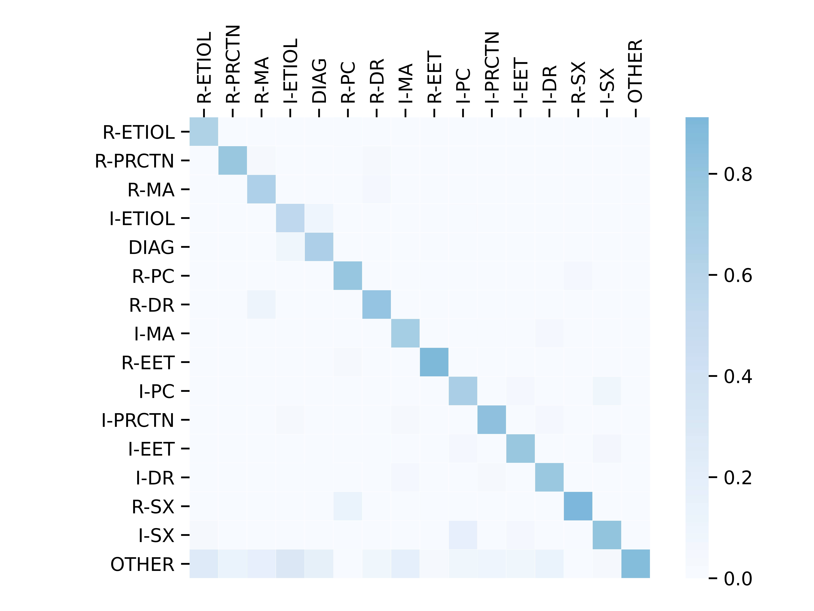

# DialoAMC

This repo contains a new corpus benchmark called **DialoAMC** for automated medical consultation system, as well as the code for reproducing the experiments in the paper [A Benchmark for Automatic Medical Consultation System: Frameworks, Tasks and Datasets](https://arxiv.org/abs/2204.08997). 

### News

- The test set of DialoAMC is host on [CBLEU](https://tianchi.aliyun.com/specials/promotion/2021chinesemedicalnlpleaderboardchallenge) at [TIANCHI](https://tianchi.aliyun.com/competition/gameList/activeList) platform. See more details in https://github.com/lemuria-wchen/imcs21-cblue. Welcome to submit your results on [CBLEU](https://tianchi.aliyun.com/specials/promotion/2021chinesemedicalnlpleaderboardchallenge), or compare our results on the validation set.   
- Please see more details in our arxiv paper [A Benchmark for Automatic Medical Consultation System: Frameworks, Tasks and Datasets](https://arxiv.org/abs/2204.08997).
- DialoAMC is released, containing a total of 4,116 annotated medical consultation records that covers 10 pediatric diseases.   

### TODO

- Update the results of dev set for DDP task
- Detailed documents of instruction on DDP task

### Overview of Experiments

We provide the code for most of the baseline models, all of which are based on python 3, and we provide the environment and running procedure for each baseline.

The baseline includes: 

- NER task: [Lattice LSTM](https://arxiv.org/abs/1805.02023), [BERT](https://arxiv.org/abs/1810.04805), [ERNIE](https://arxiv.org/abs/1904.09223), [FLAT](https://aclanthology.org/2020.acl-main.611.pdf), [LEBERT](https://aclanthology.org/2021.acl-long.454/)
- DAC task: [TextCNN](https://arxiv.org/abs/1408.5882), [TextRNN](https://www.ijcai.org/Proceedings/16/Papers/408.pdf), [TextRCNN](https://ojs.aaai.org/index.php/AAAI/article/view/9513), [DPCNN](https://riejohnson.com/paper/dpcnn-acl17.pdf), [BERT](https://arxiv.org/abs/1810.04805), [ERNIE](https://arxiv.org/abs/1904.09223)
- SLI task: [BERT-MLC](https://arxiv.org/abs/1810.04805), [BERT-MTL](https://arxiv.org/abs/1810.04805)
- MRG task: [Seq2Seq](https://arxiv.org/abs/1602.06023), [PG](https://arxiv.org/abs/1704.04368), [Transformer](https://arxiv.org/abs/1706.03762), [T5](https://arxiv.org/abs/1910.10683), [ProphetNet](https://arxiv.org/abs/2001.04063) 
- DDP task: [DQN](https://aclanthology.org/P18-2033/), [KQ-DQN](https://arxiv.org/abs/1901.10623), [REFUEL](https://dl.acm.org/doi/pdf/10.5555/3504035.3504316), [GAMP](https://ojs.aaai.org/index.php/AAAI/article/view/5456), [HRL](https://arxiv.org/abs/2004.14254)

### Results of NER Task

To evaluate NER task, we use two types of metrics, entity-level and token-level. Due to space limitations, we only keep the results of token-level metrics in our [paper](https://arxiv.org/abs/2204.08997). 

For entity-level, we report token-level F1 score for each entity category, as well as the overall F1 score, following the setting of [CoNLL-2003](https://aclanthology.org/W03-0419/).

For token-level, we report the Precision, Recall and F1 score (micro).  

The follow baseline codes are available: 

- [BERT-CRF](https://github.com/lemuria-wchen/imcs21/tree/main/task/NER/BERT-NER)
- [LEBERT](https://github.com/lemuria-wchen/imcs21/tree/main/task/NER/LEBERT-NER) 

<table>
<thead>
  <tr>
    <th rowspan="2">Models</th>
    <th rowspan="2">Split</th>
    <th colspan="6">Entity-Level</th>
    <th colspan="3">Token-Level</th>
  </tr>
  <tr>
    <th>SX</th>
    <th>DN</th>
    <th>DC</th>
    <th>EX</th>
    <th>OP</th>
    <th>Overall</th>
    <th>P</th>
    <th>R</th>
    <th>F1</th>
  </tr>
</thead>
<tbody>
  <tr>
    <td rowspan="2">Lattice LSTM</td>
    <td>Dev</td>
    <td>90.61</td>
    <td>88.12</td>
    <td>90.89</td>
    <td>90.44</td>
    <td>91.14</td>
    <td>90.33</td>
    <td>89.62</td>
    <td>91.00</td>
    <td>90.31</td>
  </tr>
  <tr>
    <td>Test</td>
    <td>90.00</td>
    <td>87.84</td>
    <td>91.32</td>
    <td>90.55</td>
    <td>93.42</td>
    <td>90.10</td>
    <td>89.37</td>
    <td>90.84</td>
    <td>90.10</td>
  </tr>
  <tr>
    <td rowspan="2">BERT</td>
    <td>Dev</td>
    <td>91.15</td>
    <td>89.74</td>
    <td>90.97</td>
    <td>90.74</td>
    <td>92.57</td>
    <td>90.95</td>
    <td>88.99</td>
    <td>92.43</td>
    <td>90.68</td>
  </tr>
  <tr>
    <td>Test</td>
    <td>90.59</td>
    <td>89.97</td>
    <td>90.54</td>
    <td>90.48</td>
    <td>94.39</td>
    <td>90.64</td>
    <td>88.46</td>
    <td>92.35</td>
    <td>90.37</td>
  </tr>
  <tr>
    <td rowspan="2">ERNIE</td>
    <td>Dev</td>
    <td>91.28</td>
    <td>89.68</td>
    <td>90.92</td>
    <td>91.15</td>
    <td>92.65</td>
    <td>91.08</td>
    <td>89.36</td>
    <td>92.46</td>
    <td>90.88</td>
  </tr>
  <tr>
    <td>Test</td>
    <td>90.67</td>
    <td>89.89</td>
    <td>90.73</td>
    <td>90.97</td>
    <td>94.33</td>
    <td>90.78</td>
    <td>88.87</td>
    <td>92.27</td>
    <td>90.53</td>
  </tr>
  <tr>
    <td rowspan="2">FLAT</td>
    <td>Dev</td>
    <td>90.90</td>
    <td>89.95</td>
    <td>90.64</td>
    <td>90.58</td>
    <td>93.14</td>
    <td>90.80</td>
    <td>88.89</td>
    <td>92.23</td>
    <td>90.53</td>
  </tr>
  <tr>
    <td>Test</td>
    <td>90.45</td>
    <td>89.67</td>
    <td>90.35</td>
    <td>91.12</td>
    <td>93.47</td>
    <td>90.58</td>
    <td>88.76</td>
    <td>92.07</td>
    <td>90.38</td>
  </tr>
  <tr>
    <td rowspan="2">LEBERT</td>
    <td>Dev</td>
    <td>92.61</td>
    <td>90.67</td>
    <td>90.71</td>
    <td>92.39</td>
    <td>92.30</td>
    <td>92.11</td>
    <td>86.95</td>
    <td>93.05</td>
    <td>89.90</td>
  </tr>
  <tr>
    <td>Test</td>
    <td>92.14</td>
    <td>90.31</td>
    <td>91.16</td>
    <td>92.35</td>
    <td>93.94</td>
    <td>91.92</td>
    <td>86.53</td>
    <td>92.91</td>
    <td>89.60</td>
  </tr>
</tbody>
</table>

### Results of DAC Task

To evaluate DAC task, we report the Precision, Recall, F1 score (macro), as well as Accuracy.

The follow baseline codes are available:

- [TextCNN, TextRNN, TextRCNN, DPCNN](https://github.com/lemuria-wchen/imcs21/tree/main/task/DAC/DNN-DAC)
- [BERT, ERNIE](https://github.com/lemuria-wchen/imcs21/tree/main/task/DAC/BERT-DAC)

<table>
<thead>
  <tr>
    <th>Models</th>
    <th>Split</th>
    <th>P</th>
    <th>R</th>
    <th>F1</th>
    <th>Acc</th>
  </tr>
</thead>
<tbody>
  <tr>
    <td rowspan="2">TextCNN</td>
    <td>Dev</td>
    <td>73.09</td>
    <td>70.26</td>
    <td>71.26</td>
    <td>77.77</td>
  </tr>
  <tr>
    <td>Test</td>
    <td>74.76</td>
    <td>70.06</td>
    <td>71.91</td>
    <td>78.93</td>
  </tr>
  <tr>
    <td rowspan="2">TextRNN</td>
    <td>Dev</td>
    <td>74.02</td>
    <td>68.43</td>
    <td>70.71</td>
    <td>78.14</td>
  </tr>
  <tr>
    <td>Test</td>
    <td>72.53</td>
    <td>70.99</td>
    <td>71.23</td>
    <td>78.46</td>
  </tr>
  <tr>
    <td rowspan="2">TextRCNN</td>
    <td>Dev</td>
    <td>71.43</td>
    <td>72.68</td>
    <td>71.50</td>
    <td>77.67</td>
  </tr>
  <tr>
    <td>Test</td>
    <td>74.29</td>
    <td>72.07</td>
    <td>72.84</td>
    <td>79.49</td>
  </tr>
  <tr>
    <td rowspan="2">DPCNN</td>
    <td>Dev</td>
    <td>70.10</td>
    <td>70.91</td>
    <td>69.85</td>
    <td>77.14</td>
  </tr>
  <tr>
    <td>Test</td>
    <td>71.29</td>
    <td>71.82</td>
    <td>71.38</td>
    <td>77.91</td>
  </tr>
  <tr>
    <td rowspan="2">BERT</td>
    <td>Dev</td>
    <td>75.19</td>
    <td>76.31</td>
    <td>75.66</td>
    <td>81.00</td>
  </tr>
  <tr>
    <td>Test</td>
    <td>75.53</td>
    <td>77.24</td>
    <td>76.28</td>
    <td>81.65</td>
  </tr>
  <tr>
    <td rowspan="2">ERNIE</td>
    <td>Dev</td>
    <td>76.04</td>
    <td>76.82</td>
    <td>76.37</td>
    <td>81.60</td>
  </tr>
  <tr>
    <td>Test</td>
    <td>75.72</td>
    <td>76.94</td>
    <td>76.25</td>
    <td>81.91</td>
  </tr>
</tbody>
</table>

#### Error Analysis of DAC Task

The visualization of the classification confusion matrix predicted by ERNIE model on the test set is demonstrated in the below figure. It can be seen that there are few classification errors in most utterance categories, except for `OTHER` category. 



### Results of SLI Task

For the evaluation of SLI-EXP and SLI-IMP task, there is a little difference since SLI-IMP task needs to additionally predict the symptom label. We divide the evaluation process into two steps, the first step is to evaluate the performance of `symptom recognition`, and the second step is to evaluate the performance of `symptom (label) inference`.

For symptom recognition, it cares only whether the symptom entities are identified or not. We use metrics of multi-label classification that are widely explored in the paper [A Unified View of Multi-Label Performance Measures](https://arxiv.org/abs/1609.00288). It includes example-based metrics: Subset Accuracy (SA), Hamming Loss (HL), Hamming Score (HS), and label-based metrics: Precision (P), Recall (R) and F1 score (F1) (micro).      

For symptom label inference, it evaluates only on those symptoms that are correctly identified, about whether their label is correct or not. We report the F1 score for each symptom label (Positive, Negative and Not sure), as well as the overall F1 score (macro) and the accuracy.  

The follow baseline codes are available:

- [BERT-MLC](https://github.com/lemuria-wchen/imcs21/tree/main/task/SLI/MLC-SLI)
- [BERT-MTL](https://github.com/lemuria-wchen/imcs21/tree/main/task/SLI/MTL-SLI)

**NOTE**: BERT-MLC are valid for SLI-EXP and SLI-IMP tasks, while BERT-MTL is valid only for SLI-IMP task.

<table>
<thead>
  <tr>
    <th rowspan="2">Models</th>
    <th rowspan="2">Split</th>
    <th colspan="3">Example-based</th>
    <th colspan="3">Label-based</th>
  </tr>
  <tr>
    <th>SA</th>
    <th>HL</th>
    <th>HS</th>
    <th>P</th>
    <th>R</th>
    <th>F1</th>
  </tr>
</thead>
<tbody>
  <tr>
    <td colspan="8">SLI-EXP (Symptom&nbsp;&nbsp;&nbsp;Recognition)</td>
  </tr>
  <tr>
    <td rowspan="2">BERT-MLC</td>
    <td>Dev</td>
    <td>75.63</td>
    <td>10.12</td>
    <td>86.53</td>
    <td>86.50</td>
    <td>93.80</td>
    <td>90.00</td>
  </tr>
  <tr>
    <td>Test</td>
    <td>73.24</td>
    <td>10.10</td>
    <td>84.58</td>
    <td>86.33</td>
    <td>93.14</td>
    <td>89.60</td>
  </tr>
  <tr>
    <td colspan="8">SLI-IMP (Symptom&nbsp;&nbsp;&nbsp;Recognition)</td>
  </tr>
  <tr>
    <td rowspan="2">BERT-MLC</td>
    <td>Dev</td>
    <td>33.61</td>
    <td>40.87</td>
    <td>81.34</td>
    <td>85.03</td>
    <td>95.40</td>
    <td>89.91</td>
  </tr>
  <tr>
    <td>Test</td>
    <td>34.16</td>
    <td>39.52</td>
    <td>82.22</td>
    <td>84.98</td>
    <td>94.81</td>
    <td>89.63</td>
  </tr>
  <tr>
    <td rowspan="2">BERT-MTL</td>
    <td>Dev</td>
    <td>36.61</td>
    <td>38.12</td>
    <td>84.33</td>
    <td>95.83</td>
    <td>86.67</td>
    <td>91.02</td>
  </tr>
  <tr>
    <td>Test</td>
    <td>35.88</td>
    <td>38.77</td>
    <td>83.76</td>
    <td>96.11</td>
    <td>86.18</td>
    <td>90.88</td>
  </tr>
  <tr>
    <td colspan="8">SLI-IMP (Symptom&nbsp;&nbsp;&nbsp;Inference)</td>
  </tr>
  <tr>
    <td></td>
    <td></td>
    <td>POS</td>
    <td>NEG</td>
    <td>NS</td>
    <td>Overall</td>
    <td>Acc</td>
    <td></td>
  </tr>
  <tr>
    <td rowspan="2">BERT-MLC</td>
    <td>Dev</td>
    <td>81.85</td>
    <td>47.99</td>
    <td>58.42</td>
    <td>62.76</td>
    <td>72.84</td>
    <td></td>
  </tr>
  <tr>
    <td>Test</td>
    <td>81.25</td>
    <td>46.53</td>
    <td>59.14</td>
    <td>62.31</td>
    <td>71.99</td>
    <td></td>
  </tr>
  <tr>
    <td rowspan="2">BERT-MTL</td>
    <td>Dev</td>
    <td>79.83</td>
    <td>53.38</td>
    <td>60.94</td>
    <td>64.72</td>
    <td>71.38</td>
    <td></td>
  </tr>
  <tr>
    <td>Test</td>
    <td>79.64</td>
    <td>53.87</td>
    <td>60.20</td>
    <td>64.57</td>
    <td>71.08</td>
    <td></td>
  </tr>
</tbody>
</table>

### Results of MRG Task

In MRG task, we use the concatenation of all NON-OTHER categories of utterances to generate medical reports. During inference, the categories of utterances in the test set is pre-predicted by the trained ERNIE model of DAC task. 

To evaluate MRG task, we report both BLEU and ROUGE score, i.e., BLEU-2/4 and ROUGE-1/2/L. We also report Concept F1 score (C-F1)  to measure the model’s effectiveness in capturing the medical concepts that are of importance, and Regex-based Diagnostic Accuracy (RD-Acc), to measure the model’s ability to judge the disease. 

The follow baseline codes are available:

- [Seq2seq, PG, Transformer](https://github.com/lemuria-wchen/imcs21/tree/main/task/MRG/opennmt)
- [T5](https://github.com/lemuria-wchen/imcs21/tree/main/task/MRG/t5)
- [ProphetNet](https://github.com/lemuria-wchen/imcs21/tree/main/task/MRG/prophetnet)

**NOTE**: To calculate C-F1 score, the trained BERT model in NER task is utilized. See details in `eval_ner_f1.py`. To calculate RD-Ac, a simple regex-based method is utilized, see details in `eval_acc.py`.   

<table>
<thead>
  <tr>
    <th>Models</th>
    <th>B-2</th>
    <th>B-4</th>
    <th>R-1</th>
    <th>R-2</th>
    <th>R-L</th>
    <th>C-F1</th>
    <th>D-Acc</th>
  </tr>
</thead>
<tbody>
  <tr>
    <td>Seq2Seq</td>
    <td>54.43</td>
    <td>43.95</td>
    <td>54.13</td>
    <td>43.98</td>
    <td>50.42</td>
    <td>36.73</td>
    <td>48.34</td>
  </tr>
  <tr>
    <td>PG</td>
    <td>58.31</td>
    <td>49.31</td>
    <td>59.46</td>
    <td>49.79</td>
    <td>56.34</td>
    <td>46.36</td>
    <td>56.60</td>
  </tr>
  <tr>
    <td>Transformer</td>
    <td>58.57</td>
    <td>47.67</td>
    <td>57.25</td>
    <td>46.29</td>
    <td>53.29</td>
    <td>40.64</td>
    <td>54.50</td>
  </tr>
  <tr>
    <td>T5</td>
    <td>62.57</td>
    <td>52.48</td>
    <td>61.20</td>
    <td>50.98</td>
    <td>58.18</td>
    <td>46.55</td>
    <td>47.60</td>
  </tr>
  <tr>
    <td>ProphetNet</td>
    <td>58.11</td>
    <td>49.06</td>
    <td>61.18</td>
    <td>50.33</td>
    <td>57.94</td>
    <td>49.61</td>
    <td>55.36</td>
  </tr>
</tbody>
</table>

### Results of DDP Task

To evaluate DDP task, we report Symptom Recall (Rec), Diagnostic Accuracy (Acc) and the average number of interactions (# Turns).  

The follow baseline codes are available:

- [DQN, REFUEL, KR-DQN, GAMP, HRL](https://github.com/lemuria-wchen/imcs21/tree/main/task/DDP)

**NOTE**: We use the [open source implementation](https://github.com/Guardianzc/DISCOpen-MedBox-DialoDiagnosis) for all baselines, since none of these papers provide any official repos or codes. 

<table>
<thead>
  <tr>
    <th>Models</th>
    <th>Rec</th>
    <th>Acc</th>
    <th># Turns</th>
  </tr>
</thead>
<tbody>
  <tr>
    <td>DQN</td>
    <td>0.047</td>
    <td>0.408</td>
    <td>9.750</td>
  </tr>
  <tr>
    <td>REFUEL</td>
    <td>0.262</td>
    <td>0.505</td>
    <td>5.500</td>
  </tr>
  <tr>
    <td>KR-DQN</td>
    <td>0.279</td>
    <td>0.485</td>
    <td>5.950</td>
  </tr>
  <tr>
    <td>GAMP</td>
    <td>0.067</td>
    <td>0.500</td>
    <td>1.780</td>
  </tr>
  <tr>
    <td>HRL</td>
    <td>0.295</td>
    <td>0.556</td>
    <td>6.990</td>
  </tr>
</tbody>
</table>

### How to Cite

If you extend or use this work, please cite the [paper](https://arxiv.org/abs/2204.08997) where it was introduced.

```
@article{chen2022benchmark,
  title={A Benchmark for Automatic Medical Consultation System: Frameworks, Tasks and Datasets},
  author={Chen, Wei and Li, Zhiwei and Fang, Hongyi and Yao, Qianyuan and Zhong, Cheng and Hao, Jianye and Zhang, Qi and Huang, Xuanjing and Wei, Zhongyu and others},
  journal={arXiv preprint arXiv:2204.08997},
  year={2022}
}
```
